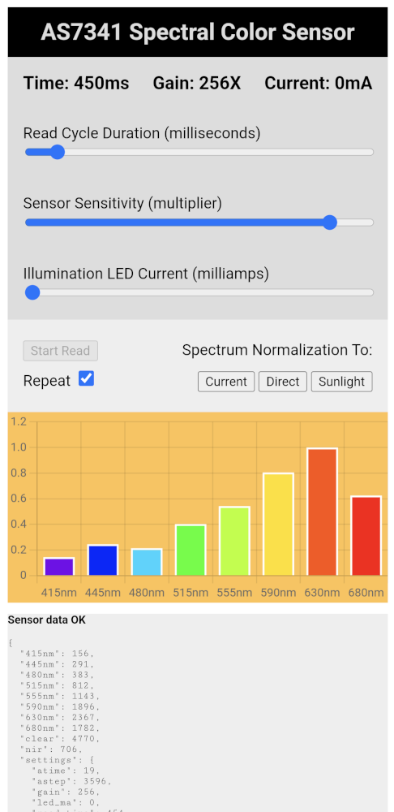

# AS7341 Web UI
This project implements a browser-based interface for interactively
experimenting with an AS7341 spectral color sensor. An ESP32 communicates
with the AS7341 via I2C and serves the interface to a browser via WiFi.

---

## Hardware
* ESP32 microcontroller. Developed on chip_id ESP32-D0WDQ6 (revision 1)
of [ESP32 mini development board](https://amzn.to/3kx92rp)(*)
* AS7341 sensor. Developed with [Adafruit #4698 breakout board](https://www.adafruit.com/product/4698)
* Any device with modern browser. (I primarily use with Chrome browser on an
Android phone.)

Wiring use standard Arduino ESP32 assignments: GPIO22 is SCL, GPIO21 is SDA

ESP32 activity indicator LED on GPIO2 (can be changed in Arduino sketch.)

---

## Instructions for use:

1. [Install ESP32 Arduino Core](https://docs.espressif.com/projects/arduino-esp32/en/latest/installing.html) if not already present.
2. Download or "git clone" this repository
3. Open esp32-as7341/esp32-as7341.ino (Developed on Arduino IDE 2.0.3)
4. Edit `secrets.h` and fill in your WiFi network name and password
5. Compile and upload to ESP32
6. Open browser to 'http://esp32-as7341.local'. If mDNS address of
'esp32-as7341.local' does not work, wait a few minutes and try again. (mDNS
needs a bit of time to propagate.) If it still doesn't work, use the local IP
address. Open Arduino IDE Serial Monitor to watch for bootup message. Upon
successful connection, it will show the network name and assigned IP address.

WiFi must have general internet access in order to download a precompiled
version of [Chart.js library](https://www.chartjs.org/) for the bar graph.

By default, upon launch the app will immediately start reading the sensor
continuously with default parameters.

### Parameters

Top three sliders are parameters:
1. Read cycle duration is the estimated time taken per read. Because the sensor
doesn't have enough ADC to read from all its sensors, we configure the sensor
multiplexer (SMUX) to read some of the sensors then reconfigure to read the
rest of sensors. This this estimated time is the sum of sensor integration time
(equivalent to shutter time in photography) once for each configuration,
plus 50ms to account for other overhead.
2. Sensor sensitivity is an amplification from sensor default values. Higher
gain values will result in stronger signal, but the signal will be noisier.
(Photography analogy: 1X gain is ISO 100, 256X gain is ISO 25600.)
3. Illumination LED current controls the onboard LED. 0 turns off the LED.
4mA is minimum and 150mA is maximum light. (AS7341 register allows specifying
current up to 258mA but the LED on Adafruit's AS7341 breakout board has a
limit of 150mA.)

### Start/Stop

Since the app starts continous read automatically, the "Start Read" button
starts deactivated. To stop continuous read, uncheck "Repeat" and it will
stop after completing the current read. At that point, "Start Read" button
should be enabled. Leave "Repeat" unchecked and press "Start Read" to take
a single reading. Check "Repeeat" and press "Start Read" to resume
continuous reading.

### Spectrum Normalization (White Balance)

The spectrum plot is normalized against sunlight by default. To turn off
normalization and see sensor values directly, click "Direct" button.

When use under artificial lighting, point at something that the sensor
should treat as white and click "Current". Normalization curve will be
recalculated so all spectral bars read 1.0 under the new reference.

To reset back to sunlight normalization, click "Sunlight" button.

### Spectral Chart

The bar graph represents values from AS7341 spectral sensors F1-F8,
corresponding to various wavelengths. The remaining three AS7341 sensors
(Clear, NIR, and Flicker) are not represented on this chart.

Each bar of the chart is represented by a color most closely associated
with its wavelength.

Under normal operation, each bar has a white border. When any of the sensors
reach saturation level (a.k.a. overexposure) including Clear and NIR channels
the white border turns red as warning that values are unreliable.

Chart background color is an approximation of the color seen by the sensor.
This is only a crude approximation until I dive into color theory and CIE
color spaces to figure out how to do this right. (Or until someone does
the hard work and creates a pull request.) Want to tackle the challenge?
[This might be helpful.](https://scipython.com/blog/converting-a-spectrum-to-a-colour/)

### Raw Sensor Data

At the bottom of the page, raw sensor values as sent by ESP32 are listed.

---

## Development/Testing Web UI Updates

One advantage of using web-based technology is that we can edit a source file
and press F5 to see updates much more quickly than recompiling and uploading
code via Arduino IDE. (Which is a bit tricky for this project, more details in
the next section.)

Use any web server software to serve this repository. If Docker Compose is
installed, you can run `docker compose up` to launch `nginx-alpine` to serve
this repository on the local machine at port 18080.

The `index.html` file at root has links to `basic` and `standard`. pages.
`standard` is what is shown by default. `basic` is an earlier version of the UI
with no stylesheet and no bar chart useful for diagnosis and debugging.

Inside `standard/script.js` change `const devtest` from `false` to `true`. This
points the URL fetch operation to `http://esp32-as7341.local`.

If the browser reports blocking due to CORS policy, open the Arduino sketch and
change `allow_all_origin` to `true`. Recompile and upload.

---

## Updating Web UI

Once we're satisfied with web UI updates, we can upload them to Arduino.
Because Arduino IDE doesn't really have the concept of uploading files to the
microcontroller as-is, we have to package the web UI files into the ARduino
sketch. I didn't want to deal with escaping quotes and what not, so instead of
including them as text files, they were embedded as binary files. So updating
the web UI means updating the binary hexadecimal representation in the Arduino
sketch. The follow instructions use the command-line tool `xxd` but any tool
converting files to hexadecimal bytes should work. (Be sure to have termination
null character.)

### Example: updating standard `script.js` with `xxd`

1. Go into `esp32-as7341` subdirectory.
2. Run `xxd -i ../standard/script.js standard.script.js.h` to convert
`script.js` to a header file full of hexadecimal values.
3. Open `standard.script.js.h` in a text editor.
4. At the top of the file, change `unsigned char ___standard_script_js` to
`const char standard_script_js`
5. At the bottom of the file after the final byte (probably `0x0a`),
append the null termination character `, 0x00`.
6. Repeat as needed for `index.html` and `style.css`
7. In Arduino IDE, recompile and upload to ESP32.

Note: Before doing this, undo dev/test configuration changes. Verify that:
1. `standard/script.js` has `const devtest` set to `false`.
2. Arduino sketch has `allow_all_origin` set to `false`

---

## Project Log

For more details on how this project came about, design decisions, and
especially the dumb mistakes I made, see posts tagged "as7341"
[on my project diary NewScrewdriver.com.](https://newscrewdriver.com/tag/as7341/)

---

(*) Disclosure: As an Amazon Associate I earn from qualifying purchases.
